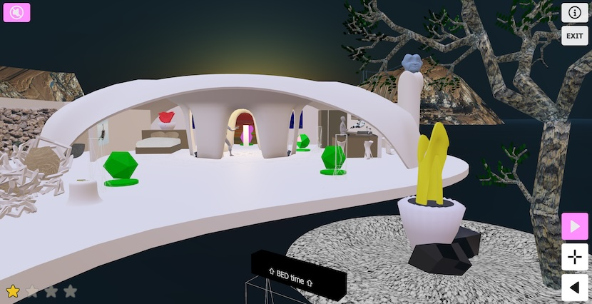
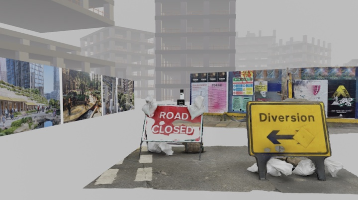

# Immersions 3D & VR - Point & Click Library for the Web
<p align="center">
  
</p>

Immersions is an open-source JavaScript library for building immersive point‑and‑click experiences in WebXR. Powered by the [Babylon.js](https://www.babylonjs.com/) 3D engine, it runs seamlessly in browsers across desktop, mobile, and VR headsets.

The library is built on the belief that the web is the best medium for creating an open network of virtual experiences accessible to everyone.

It was originally developed in January 2021 as part of a [platform](https://bruchansky.xyz/immersions/) dedicated to immersive art on the web. From the start, I wanted to avoid depending on commercial platforms and being limited by the artificial scarcity models they impose.

Since then, the project has gone through significant updates, evolving into a point-and-click library where users can also collect items along their journey.

I continue to update the engine to meet my own artistic needs, and contributions from others are always welcome.

Features:

* **Point and Click Navigation**:create viewpoints, add 3D exhibits, text and audio to tell your story.

* **Cross-platform**:works on most browsers - mobile, desktop and virtual reality headsets (tested on Meta Quest 2 and Pico).

* **Open Source**: you own and retain full control over your virtual space.

* **Boundless**: whether you are an artist, architect or designer, the only limit is your imagination.


👉 Explore [art projects built with Immersions](https://bruchansky.xyz/projects/)

## License 

This library is available under the Apache-2.0 License and free to use, provided that end users are given access to the project homepage: https://bruchansky.xyz/immersions

See [**NOTICE**](./NOTICE) file for more details.

## Installation 

1.  Download all folders:
    * The immersion\_engine is where the immersion library and all assets are.
    * The immersion-demo folder is where you’ll find a documented example on how to use the immersion library. 
2.  Install a web server on your local machine so that you can test your immersion. I personally use Python [SimpleHTTPServer](https://www.linuxjournal.com/content/tech-tip-really-simple-http-server-python). 
3.  Start your local server: open a terminal window (I use [iTerm2](https://iterm2.com/) on Mac and Windows Terminal on Windows), go to the directory where you've downloaded the 2 subfolders, and start your server with the following command: “python3 -m http.server 9000” (might be another port).
4.  Open your browser and run the demo: localhost:9000/immersion_demo/index.html.
5.  And that’s it! You’re all set to start building. I deliberately avoided using frameworks so the JavaScript runs out-of-the-box on a simple web server.

## How to use the immersion engine

*   On chrome, use the [developer console](https://balsamiq.com/support/faqs/browserconsole/#:~:text=To%20open%20the%20developer%20console,(on%20Windows%2FLinux).) to debug your immersion (with [cache disabled](https://www.webinstinct.com/faq/how-to-disable-browser-cache#:~:text=When%20you're%20in%20Google,close%20out%20of%20Developer%20Tools.) so that you always test the latest version).
*   You can configure the following parameters of the immersion engine either by editing the index.html (see example in the demo) or by passing them in the URL:
    *   "lang" parameter for the language ("en" by default).
    *    "mode" parameter for the navigation mode:
        *   'arc' is the default navigation.
        *   'dvp' is a universal camera navigation with extra information for development (camera and mesh positions).
        *   'minimal' is for creating 3D scenes wth mininal interaction possible (good for 3D homescreens or walkthroughs)
        *    'screenshot' mode hides all stands for video and image captures.
    *   "mute" parameter is false by default
    *   "dest" parameter is like an html anchor but in 3D spaces, it goes directly to the stand with that name. 

## Creating your 3D assets

Here are some tips on how to easily create your digital assets. 

*   If you publish your immersion online (which I hope you will), keep an eye on the total size of your assets. My recommendation is to not exceed 20Mb. 
*   To create 3D models, the standard is the [Blender](https://www.blender.org/) open source software. But I personally prefer to create 3D models directly in virtual reality using softwares such as [Gravity Sketch](https://www.gravitysketch.com/)\* on the Meta Quest.
*   For animations, I use [Mixamo](https://www.mixamo.com/).
*   I personally use [Polycam](https://poly.cam/) for 3D scans. Don’t expect perfect results but it does the job.
   
<p align="center">
  
</p>

## Build your Own Immersion

Now that you have installed the immersion engine and have created your 3D assets, it’s time to bring everything together.

Immersions are composed of reusable navigation elements called “stands”. Stands allow visitors to interact with their environment whether in virtual reality, on desktop, mobile or tablet. Immersions will automatically display a user interface on mobile or desktop, and will handle most common VR navigation. So that you can focus on the point and click experience you want to create, and not think too much about engine setup or navigation. 

Here are the different types of stands you can create, all are documented in the demo folder:
```
“Stands” are the simplest ones, they are like viewpoints: 
  a simple way for visitors to move around in your immersion.

“Teleporters” are stands that teleport visitors to another location (another stand) in your immersion.
  
“Links” are stands that open external links.
  
“Displays” are stands that display texts and can play sounds

“Plinths” are displays for 3D models.
```

Beyond stands, you can also add collectable items. The engine will handle the rest—making them clickable, styling them consistently, and associating them with stars to collect.

```
yourMesh.actionManager = immersion.addInteraction(yourMesh, true, standName); 
```

Enjoy!
