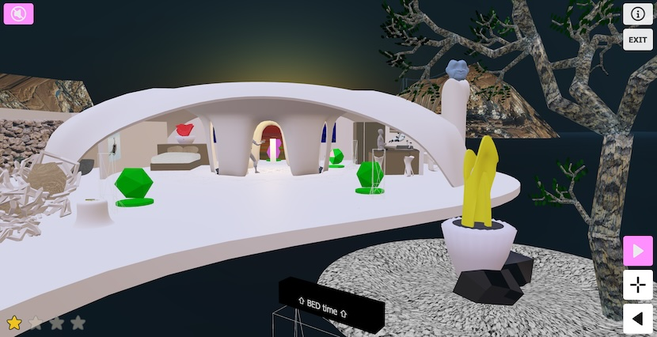

# Immersions 3D & VR - Point & Click Library for the Web

[](LICENSE)
[](https://www.babylonjs.com/)

<p align="center">
  
</p>

Immersions is an open-source JavaScript library for building immersive experiences in WebXR. Powered by the [Babylon.js](https://www.babylonjs.com/) 3D engine, it runs seamlessly in browsers across desktop, mobile, and VR headsets.

The library is based on the idea that the web is the best foundation for building an open network of virtual experiences. It was originally developed in January 2022 as part of an [immersive artistic platform](https://bruchansky.xyz/immersions/). From the outset, the aim was to steer clear of commercial platforms as a means of artistic expression.

Since then, the project has seen major updates and grown into a library capable of powering anything from simple point-and-click games to cinematic 3D replays.

I continue to update the engine to meet my own artistic needs, and contributions from others are always welcome.

Features:

* **Point and Click Navigation**: create viewpoints, attach 3D exhibits, text and audio to tell your story.

* **Collection system**: collect items and unlock a completion state once a set number of items has been gathered.

* **Cross-platform**: works on most browsers - mobile, desktop and virtual reality headsets (tested on Meta Quest 2, 3 and Pico).

* **Cinematic mode**: automatically replay a scene with subtitles and camera animations.

* **AI-ready**: structured and documented so AI agents can generate and test scenes on their own.

* **Open Source**: you own and retain full control over your virtual space.

* **Boundless**: whether you are an artist, architect or designer, the only limit is your imagination.


👉 Explore [mini art games built with Immersions](https://bruchansky.xyz/immersions/)

## License

This library is available under the Apache-2.0 License and free to use.
See [**NOTICE**](./NOTICE) file for full attribution requirements.

## Installation

1.  Clone or download this repository into a folder alongside your own work:
    ```
    your-projects/
      immersion_engine/   ← this repo
      my-immersion/       ← your work (later)
    ```
2.  Install a local web server — I use Python [SimpleHTTPServer](https://www.linuxjournal.com/content/tech-tip-really-simple-http-server-python).
3.  Start the server from `your-projects/`: `python3 -m http.server 9000`
4.  Open the demo: `localhost:9000/immersion_engine/examples/demo/index.html`
5.  Copy `immersion_engine/examples/template/` into `your-projects/` and rename it to start your own immersion.

> **Production note**: the demo and template load BabylonJS from a CDN. For production deployments, replace the CDN `<script>` tags with local copies — this removes the network dependency and works fully offline.

## Building Your Immersion

Each immersion is a self-contained folder:
- `index.html` — loads BabylonJS, the engine files, your immersion class, then calls `createImmersion(ClassName)`
- `[name].js` — your immersion class extending `Immersion`
- `[name].json` — texts and stands data
- 3D assets (`.glb`, `.obj`, `.gltf`, `.vrm`, images, audio)

Immersions are composed of reusable navigation elements called **stands**. Stands let visitors interact with the scene from desktop, mobile, or VR. The engine handles the UI and navigation automatically so you can focus on your experience.

**Stand types:**
- `Stand` — basic viewpoint, no description
- `Display` — viewpoint with a title/description window and optional audio
- `Plinth` — Display with a 3D exhibit model
- `Teleporter` — teleports the visitor to another stand
- `Link` — opens an external URL

All stand types are demonstrated in `examples/demo/`.


## Rendering Modes

Pass a `mode` URL parameter to change how the scene is rendered.

| Mode | Description |
|---|---|
| *(default)* | Standard point-and-click navigation with full UI (next/previous/sound/about buttons). |
| `cinematic` | Fully automated playback. Hides all UI and stand markers. Subtitles are drawn from each stand's `description` field. The scene auto-advances through stands. |
| `menu` | Navigation-only mode. Hides sound/about/share buttons and centres the next/previous arrows. Intended for embedding the scene as a navigable menu. |
| `dvp` | Development mode. Free camera movement, coordinates display in the scene. Press `c` to copy the current position to clipboard. |
| `screenshot` | Minimizes UI and hides stand markers, for easier screen capturing |

### Additional URL parameters

| Parameter | Description |
|---|---|
| `dest` | Navigates directly to a named stand and rotates the camera continuously around it, without navigation UI — useful for previews. Can be combined with any mode. Example: `?dest=my-stand` |
| `subtitles` | Controls subtitle display in cinematic mode. Defaults to `true`. Pass `subtitles=false` to hide subtitles while keeping automated playback and camera animations. Example: `?mode=cinematic&subtitles=false` |

## Characters

The engine includes `characters/character.js`, a helper for loading and animating humanoid characters in [VRM format](https://vrm.dev/).

```js
const character = new Character(scene, "/path/to/characters/", "slug.vrm");
await character.load();
character.root.position = new BABYLON.Vector3(0, 0, 0);
character.body("default").look("right").mouth("smiling");
character.startTalking();
character.stopTalking();
```

## Tips for creating your 3D assets

Here are some tips on how to easily create your digital assets.

*   Keep an eye on total asset size — I recommend not exceeding 20Mb.
*   For 3D models, the standard is [Blender](https://www.blender.org/). I personally prefer creating models directly in VR using [Gravity Sketch](https://www.gravitysketch.com/) on the Meta Quest.
*   For animations, I use [Mixamo](https://www.mixamo.com/).
*   For 3D scans, I use [Polycam](https://poly.cam/). Don't expect perfect results but it does the job.
*   Free VRM characters can be found on [Open Source Avatars](https://www.opensourceavatars.com/).


## Contributing

Contributions are welcome. See [CONTRIBUTING.md](./CONTRIBUTING.md) for setup instructions, code conventions, and how to run tests.
